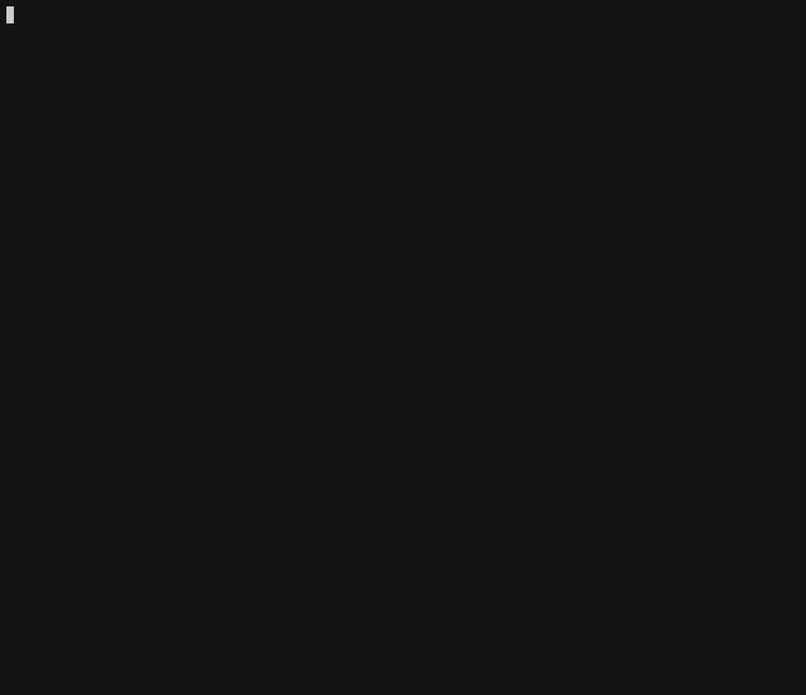

D-Prolog
===

[](https://travis-ci.com/ArkArk/d-prolog)
[](https://codecov.io/gh/ArkArk/d-prolog)
[](https://github.com/ArkArk/d-prolog/blob/master/LICENSE)

A Prolog implementation in D language.

[](https://asciinema.org/a/210436)

## Install

### Download binary

Download the [latest](https://github.com/ArkArk/d-prolog/releases/) `dprolog` binary.

### Install from source

```bash
$ git clone https://github.com/ArkArk/d-prolog.git
$ cd d-prolog
```
and build (refer to [Development](#development)).

## Usage

Look at [docs/](docs).
- [Getting Started](docs/GettingStarted.md)
- [Specification](docs/Specification.md)

## Development

### Requirements

- [DMD](https://dlang.org/download.html#dmd): a compiler for D programming language
- [DUB](http://code.dlang.org/): a package manager for D programming language
- [Linenoise](https://github.com/antirez/linenoise)

#### Install Linenoise

```bash
$ git clone https://github.com/antirez/linenoise.git
$ cd linenoise
$ gcc -c -o linenoise.o linenoise.c
$ ar rcs liblinenoise.a linenoise.o
```

and move `liblinenoise.a` to `lib/` or somewhere D can find it (e.g. `/usr/lib/`).

### Build

```bash
$ dub build
```
The destination directory of the output binary is `bin`.

### Run

with no option:
```bash
$ dub run
```

with some options:
```bash
$ dub run -- -f example/family.pro -v
```

### Tests

```bash
$ dub test
```

### Release

```bash
$ git tag <version>
$ ./release.sh
```

### Future Work

- Support for Windows
- Adding more tests

## License

[MIT](https://github.com/ArkArk/d-prolog/blob/master/LICENSE)
